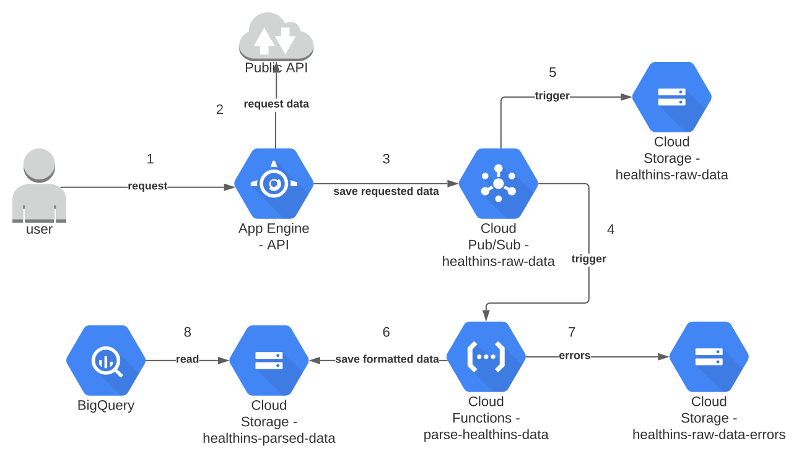

## Caso
Extrair dados de uma API pública, a partir de requisições de usuários, e salvar os dados buscados.
Realizar eventuais tratamentos nestes dados para extração de _insights_ e disponibilizá-los em um local adequado.

## Arquitetura
Ao montar esta arquitetura, tentei construir uma solução serverless. Ao utilizar vários serviços gerenciados é poupado a
necessidade de uma equipe técnica para levantar e dar manutenção em máquinas, já que tudo é gerenciado por terceiros. Assim,
o time pode gastar mais tempo na evolução da solução, entregando mais valor. 

A arquitetura da solução proposta para o problema dado pode ser vista na imagem abaixo:

Neste cenário o fluxo dos dados começa com uma requisição do usuário para uma API Restful.
A partir desta requisição será buscado os dados de interesse em uma API pública e em caso de sucesso os dados
serão enviados os dados _raw_ para um serviço de mensageria. Assim que o evento chega no serviço de mensageria é disparado a execução
de uma função para tratar os dados e salvá-los em um storage. Sendo que a mensagem raw também será persistida em outro local
para eventuais acessos. Em caso de erro na aplicação do esquema estas messagens serão salvas em outro local para análise.

### API

A API utilizada pelo usuário para requisitar os dados foi implementada utilizando o framework [FastAPI](https://fastapi.tiangolo.com),
um framework python. No diretório [app](app) pode ser encontrado todos os módulos necessários para levantar a aplicação.
Para instalar as dependências do projeto é necessário ter instalado o [poetry](https://python-poetry.org/docs/).
Mas se preferir, basta apenas construir a imagem a apartir do [Dockerfile](Dockerfile) do projeto.

Para executar a aplicação localmente é necessário ter uma key de um service account e definir algumas variáveis de ambiente, 
reponsáveis para comunicação da API com outros serviços. Sendo assim, a API está hospedada na Google Cloud Plataform, sendo utilizado o serviço gerenciado App Engine, com
todas configurações necessárias já definidas. Para acessar a aplicação basta clicar neste [link](https://bubbly-upgrade-300800.ue.r.appspot.com).

Assim que entrar no endereço fornecido, o usuário será redirecionado para uma página que possui uma
documentação da API. Além desta página, o usuário pode ir no endpoint `/docs`, onde é possível
realizar requisições para a API a partir do browser mesmo. Nesta tela já irá mostrar exemplos de requisições.

Neste projeto foi utilizado o GitHub Actions para CI/CD.

### PubSub

Após buscar os dados em formato raw na API pública, a API desenvolvida enviará as os dados para um serviço de mensageria.
Com o objetivo de diminuir o acoplamento de serviços. A partir do momento que uma messagem chegar neste serviço, automáticamente
será acionado a execução de uma função. E além disto, será salvo os dados em um storage específico para os dados raw.
Este dados serão salvos em AVRO, um formato de arquivo comprimido, consumindo menor espaço.

### Cloud Functions

Foi utilizado o FaaS da GCP para ter a responsabilidade de aplicar um esquema nos dados recebidos e garantir a 
consistência. Desta forma, quem for utilizar os dados não precisará se preocupar se o tipo de um determinado campo irá mudar ou não,
pois isto é garantido nesta etapa. Caso ocorra algum erro neste processo, os eventos que deram problemas serão enviados para um local 
diferente para identificação do erro e correção da aplicação. A cloud function definida, após aplicar o _schema_definido, irá salvar
todos os dados gerados em formato _parquet_ em um storage. Desta forma, o espaço utilizado será pequeno comparado ao tamanho original
e o egress da cloud function será menor, gerando um menor custo.

Conforme a solução escale, a cloud function irá elevar os custos e pode até não ser mais viável ela fazer parte desta arquitetura.
Dado que o objetivo foi diminuir o desacoplamento dos serviços, bastaria definir qual seria outra solução para ocupar seu lugar e simplesmente
colocá-la para consumir do tópico de eventos.

### BigQuery

Dado que no Cloud Storage estará salvo todos os dados salvos com schema aplicado, basta então utilizar uma solução para visualizar este dados.
Para isto pensei no BigQuery, com ele podemos realizar consultas em uma grande quantidade dados em tempos muito pequenos.
Caso a opção para visualização dos dados sejam outra solução, o formato parquet ajuda justamente por colunar. Pois, 
ao buscar os dados pode-se escolher as colunas de interesse e diminuir o tempo de busca pode não ter que buscar todos dados.

A forma como os dados foram salvos é bem intuitiva, segue o padrão `YYYY/MM/DD/HH/*.parquet`. Isto ajuda caso seja do interesse selecionar
um período específico dos dados para se criar as tabelas e datasets no BigQuery. E, eventualmente, exportar para outro sistema de armazenamento.

